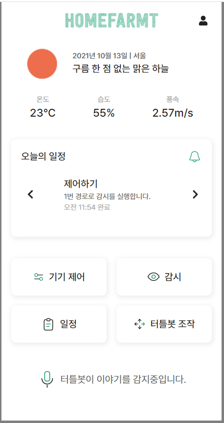
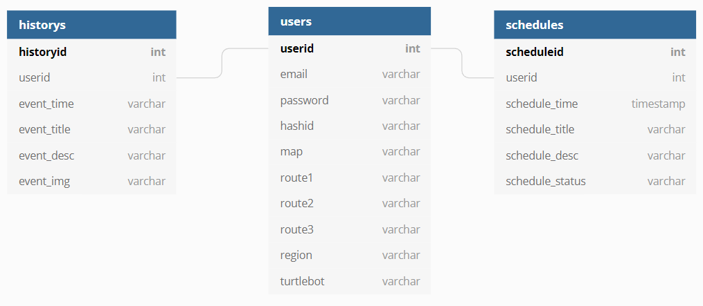
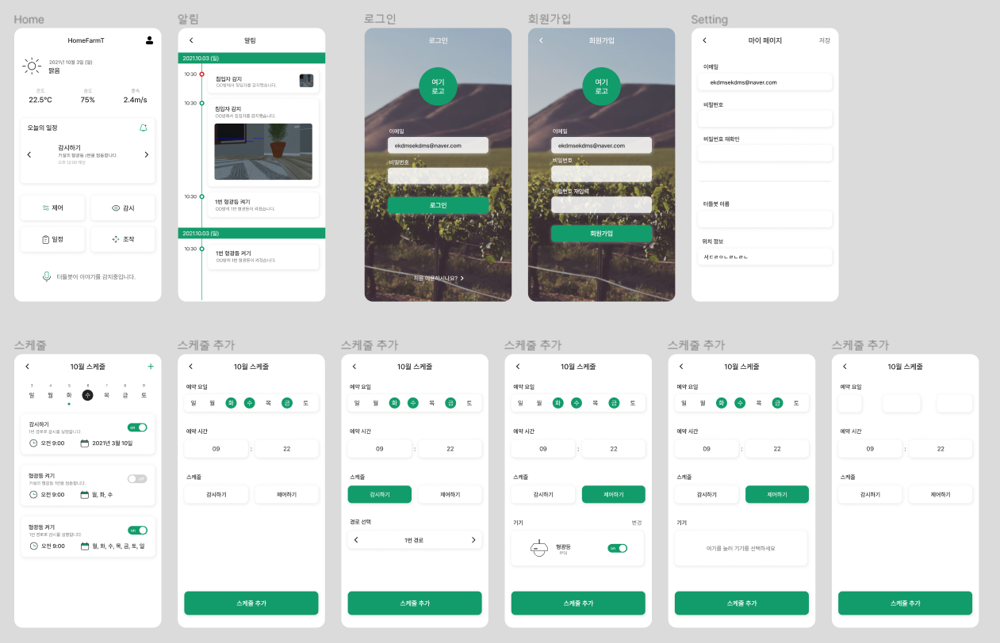
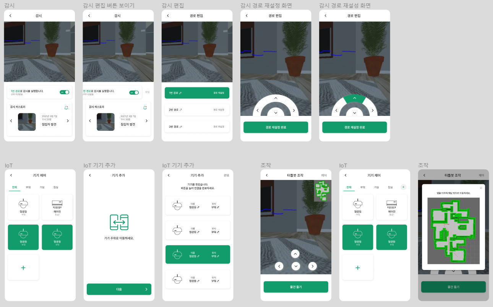

# 🏕 홈팜티 (HomeFarmT)

> 농업인을 위한 작은 스마트팜

농촌 고령화, 일손 부족 문제의 해결 방안으로 스마트팜이 제안됐습니다. 하지만, 스마트팜의 초기 투자비용, 제어기기 조작의 어려움, 우리나라 현실에 맞지 않는 빅데이터 등을 이유로 도입이 망설여지고 있습니다. 홈팜티는 이러한 문제를 해결할 수 있는, 부담없이 사용할 수 있는 작은 스마트팜입니다.

 - 서비스 명 : HomeFarmT (홈팜티)
 - 개발 기간 : 2021.08.30 ~ 2021.10.08 (6주)
 - 팀명 : 으라차차

|  이름  | 역할 |         담당 업무         | 깃허브 |
| :----: | :--: | :-----------------------: | :----: |
| 신동윤 | 팀장 | 자율주행, Frontend, 배포  |        |
| 김담영 | 팀원 |      자율주행, Unity      |        |
| 김우석 | 팀원 |  물체인식, Backend, 배포  |        |
| 이다은 | 팀원 | 자율주행, Frontend, UI/UX |        |
| 이두호 | 팀원 |      물체인식, MLOps      |        |

 

# ✨ 주요 기능
 - 기기 제어
    - 연결된 IoT 기기를 켜거나 끄기
 - 감시
    - 터틀봇에 달린 카메라를 통해 캠 화면을 보여줌
    - 현재 터틀봇의 위치를 미니맵에 표시함. 미니맵을 눌러 두 좌표를 특정하면 두 좌표 사이를 이동하며 감시
    - 터틀봇이 침입자를 발견할 시, 최근 감시 내역에 침입자 사진과 날짜, 시간이 저장됨
    - 감시하기 위해 임의의 경로를 최대 3개 기록 가능하며, on/off 가능함 
 - 일정
    - 일별로 일정(감시하기 or IoT 기기 제어)을 시간을 특정하여 생성할 수 있음. 
    - 메인 페이지의 오늘의 일정에 오늘의 일정을 출력
    - 특정된 시간에 해당 일정을 실행 (미구현)
 - 터틀봇 조작
    - 터틀봇에 달린 카메라를 통해 캠 화면을 보여줌
    - 현재 터틀봇의 위치를 미니맵에 표시함. 미니맵을 눌러 좌표를 특정하면 해당 좌표로 이동
    - 화살표 버튼을 클릭해 터틀봇을 제어
    - 물건에 가까이 이동한 후, 물건 들기/놓기 실행 가능
 - 기타
    - 사용자 지역의 날씨, 온도, 습도, 풍속 출력
    - 이동하다가 잡초를 발견하면 제거하여 작물 재배에 도움
    - STT 기능 (미구현)

 

# 🎇 구현

## 📺 기기 제어

### 1. IoT 기기 제어

## 📽 감시

### 1. 미니맵 경로로 감시

### 2. 침입자 발견

### 3. 경로 편집

### 4. 감시 실행

## 📅 일정

### 1. 일정 관리 및 오늘의 일정

## 🕹 터틀봇 조작

### 1. 미니맵 좌표로 조작

### 2. 화살표 버튼으로 터틀봇 제어

## 🎈 기타

### 1. 맵 생성

### 2. 사용자 지역의 날씨, 온도, 습도, 풍속 출력

### 3. 작물 재배 도움

### 4. 물체 회피

 

# 🧱기술 스택

 - Backend : Node.js, Express, JavaScript
 - Frontend : Vue.js, HTML/CSS, JavaScript
 - IoT 제어 : ROS2, Python, Socket.io
 - AI : TensorFlow, OpenCV (모델 SSD Mobile Net v1)
 - DB : MySQL
 - API 통신 : GraphQL 
 - Devops : Docker, Jenkins, Nginx, Grafana
 - Server : AWS EC2

 

# 📝 산출물

## 🎭 ERD

## 🖼 와이어프레임

